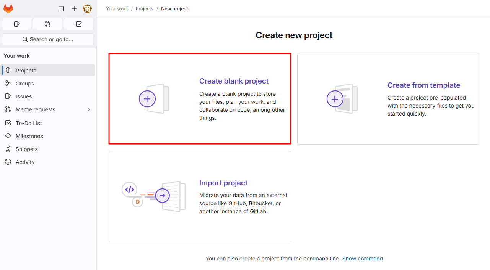

## 자체 CA를 신뢰하도록 GibLab 구성하기

### 1. Root CA 생성 (자체 인증 기관)

- 인증서를 생성하기 위한 디렉토리 생성

  ```bash
  mkdir -p ./ssl
  cd ./ssl
  ```

- OpenSSL을 사용하여 Root CA를 생성합니다.

  ```bash
  openssl genrsa -out root-ca.key 2048
  openssl req -x509 -new -nodes -key root-ca.key -sha256 -days 3650 -out root-ca.crt -subj "/CN=MyRootCA"
  ```

  - `root-ca.key` : Root CA의 개인키
  - `root-ca.crt` : Root CA 인증서

2. 생성된 Root CA 인증서를 GitLab 서버가 신뢰하도록 설정

### 2. Cert Manager로 GitLab에 사용할 TLS 인증서 발급

- Secert 생성

  ```bash
  oc create secret tls root-ca-secret \
    --cert=root-ca.crt \
    --key=root-ca.key -n cert-manager
  ```

- Root CA를 기반으로 Cert Manager에서 인증서를 발급합니다. 

  - Cert Manager Operator는 `cert-manager-operator` 네임스페이스에 설치되어 있으며, 해당 네임스페이스에서 `ClusterIssuer`를 생성해야 인스턴스에서 보여집니다.
  
    ```yaml
    apiVersion: cert-manager.io/v1
    kind: ClusterIssuer
    metadata:
      name: ca-issuer
    spec:
      ca:
        secretName: root-ca-secret
    ```
  
- Cluster Issuer 상태 확인

  상태가 아래 그림처럼 Ready 상태여야 인증서가 정상적으로 생성된 것입니다.

   <br>
- ca-issuer를 선택하여 아래 상태 확인 시 *Sigining CA verified*라고 보여야 합니다.
   <br>
- GitLab 도메인을 위한 인증서 요청

  GitLab 인증서 요청을 위해서는 GitLab Operator가 설치되어 있어야 하며, Operator 설치 시 자동으로 생성되는 `gitlab-system` 네임스페이스에 생성합니다.
  
  ```yaml
  apiVersion: cert-manager.io/v1
  kind: Certificate
  metadata:
    name: gitlab-cert
    namespace: gitlab-system
  spec:
    secretName: gitlab-tls
    commonName: "gitlab.apps.cluster-hfqtc.hfqtc.sandbox2220.opentlc.com"
    dnsNames:
      - "gitlab.apps.cluster-hfqtc.hfqtc.sandbox2220.opentlc.com" 
    issuerRef:
      name: ca-issuer
    kind: ClusterIssuer
  ```
  
  > GitLab에서 사용할 TLS Secret이 생성됩니다 (`gitlab-tls`)

- 인증서 생성 확인

  다음과 같이 상태가 Ready 상태이면 정상적으로 생성된 것 입니다.
   <br>
  
### 3. OpenShift에 인증서 등록

GibLab이 샐행되는 OpenShift 클러스터에 인증서를 등록합니다.

- Root CA를 OpenShift에서 신뢰하도록 설정

  ```bash
  oc create configmap root-ca-configmap \
    --from-file=ca.crt=root-ca.crt -n openshift-config
  oc patch proxy/cluster --type=merge -p='{"spec":{"trustedCA":{"name":"root-ca-configmap"}}}'
  ```

- GitLab Pod에 TLS 인증서 적용 : GitLab Pod가 `gitlab-tls`를 참조하도록 구성합니다.

### 4. GitLab에 Root CA 등록

인스턴스 생성 시 인증서를 참조하도록 설정합니다.

- Installed Operators > GitLab 선택 > Instance 생성 시 아래 내용을 참조하여 Instance를 생성합니다.

- Instance 생성 YAML

  ```yaml
  kind: GitLab
  apiVersion: apps.gitlab.com/v1beta1
  metadata:
    name: gitlab
    namespace: gitlab-system
  spec:
    chart:
      values:
        certmanager:
          install: true  # certmanager를 설치 여부를 제어하는 설정으로 활성화 (true)
        global:
          hosts:
            domain: apps.cluster-hfqtc.hfqtc.sandbox2220.opentlc.com  # 생성 시 gitlab이 자동으로 붙기 때문에 apps부터 입력
            hostSuffix: null
          ingress:
            enable: true  # OpenShift Ingress를 사용을 활성화 (true)
            annotations:
              cert-manager.io/cluster-issuer: "ca-issuer"  # certmanager에서 생성한 ClusterIssuer 이름을 지정하여 인증서 자동 관리
            configureCertmanager: true  # Ingress와 certmanager 간의 구성 자동화를 활성화
            tls:
              secretName: gitlab-tls # Ingress에서 사용할 인증서 Secret 이름
        postgresql:
          primary:
            extendedConfiguration: max_connections = 200
      version: 8.6.2
  ```

구성요소가 정상적으로 올라오면 gitLab 인스턴스가 Ready 상태로 변경되며, 모든 구성요소가 올라오는 데까지는 시간이 조금 걸립니다.

- 상태 확인
   <br>

### 5. Cert Manager 상태 확인

Cert Manager가 올바르게 GitLab 인증서를 발급하고 있는지 확인

- 인증서 리소스 상태 확인 

  ```bash
  oc get certificate -n gitlab-system
  ```

  - Sample Output

    ```bash
    $ oc get certificate -n gitlab-system
    NAME          READY   SECRET       AGE
  gitlab-cert   True    gitlab-tls   2m44s
    ```

- 인증서 세부 정보 확인

  ```bash
  oc describe certificate gitlab-cert -n gitlab-system
  ```

  - Sample Output

    ```bash
    $  oc describe certificate gitlab-cert -n gitlab-system
    Name:         gitlab-cert
    Namespace:    gitlab-system
    Labels:       <none>
    Annotations:  <none>
    API Version:  cert-manager.io/v1
    Kind:         Certificate
    Metadata:
      Creation Timestamp:  2024-12-14T11:03:33Z
      Generation:          1
      Resource Version:    443963
      UID:                 028c9256-88cf-4167-a362-e33586469f5d
    Spec:
      Common Name:  gitlab.apps.cluster-hfqtc.hfqtc.sandbox2220.opentlc.com
      Dns Names:
        gitlab.apps.cluster-hfqtc.hfqtc.sandbox2220.opentlc.com
      Issuer Ref:
        Kind:       ClusterIssuer
        Name:       ca-issuer
      Secret Name:  gitlab-tls
    Status:
      Conditions:
        Last Transition Time:  2024-12-14T11:03:33Z
        Message:               Certificate is up to date and has not expired
        Observed Generation:   1
        Reason:                Ready
        Status:                True
        Type:                  Ready
      Not After:               2025-03-14T11:03:33Z
      Not Before:              2024-12-14T11:03:33Z
      Renewal Time:            2025-02-12T11:03:33Z
      Revision:                1
    Events:
      Type    Reason     Age    From                                       Message
      ----    ------     ----   ----                                       -------
      Normal  Issuing    7m34s  cert-manager-certificates-trigger          Issuing certificate as Existing issued Secret is not up to date for spec: [spec.commonName spec.dnsNames]
      Normal  Reused     7m34s  cert-manager-certificates-key-manager      Reusing private key stored in existing Secret resource "gitlab-tls"
      Normal  Requested  7m34s  cert-manager-certificates-request-manager  Created new CertificateRequest resource "gitlab-cert-1"
      Normal  Issuing    7m34s  cert-manager-certificates-issuing          The certificate has been successfully issued
    ```

    > Stauts에서 Ready=True를 확인하고, 인증서가 발급되어 gitlab-tls에 저장되었는지 확인합니다.

### 6. 인증서 확인

Cert Manager가 발급한 인증서가 올바르게 Secret에 저장되었느지 확인합니다.

- Secret의 세부 정보 확인

  ```bash
  oc get secret gitlab-tls -n gitlab-system -o yaml
  ```

  - Sample Output

    ```bash
    $ oc get secret gitlab-tls -n gitlab-system -o yaml
    apiVersion: v1
    data:
      ca.crt: LS0tLS1CRUdJTiBDRVJUSUZJQ0FURS0tLS0tCk1JSURCekNDQWUrZ0F3SUJBZ0lVZlJaMlhZQjVGY3h2aG92SG4ramsxdnFHODBrd0RRWUpLb1pJaHZjTkFRRUwKQlFBd0V6RVJNQThHQTFVRUF3d0lUWGxTYjI5MFEwRXdIaGNOTWpReE1qRTBNVEEwTURJMFdoY05NelF4TWpFeQpNVEEwTURJMFdqQVRNUkV3RHdZRFZRUUREQWhOZVZKdmIzUkRRVENDQVNJd0RRWUpLb1pJaHZjTkFRRUJCUUFECmdnRVBBRENDQVFvQ2dnRUJBTlpWZnlLWnBLZUUvRmF3dUpsVmVNQmg4YzYzaGIwVlBGQVZxREdEYXpEQkhEdzkKaGhmNEx2SUlIWGNDY3NsYWdHa1ZDNVBHaHgvcllhZzFKbllJcGpXY3lGZ1JuWkJhRXVpNU5MRWo0SWthWFNCdgord3FIMkMrUGtKYTFYY1g3K3A1K0NGTnJEUjlyZnZzVFVnQjY1K1JYaWtKSmVSQjduR2JXOW1HbmhXY2N1aWYzCnlDTEFBSU9ka1UxNmhvRFZwV3huT1ZiR1lFQkNPN0hldWtnWGhmcksya2ZYYXN2T0lSVE5KbkRJSUNGWEdmbnUKNTZFbm5pYlJ6c0tLRHU5L01qS1dNRkIvWVp5ZFptUWg1NU9NNmNDMG9CRW9WeGhrY0FVcWNPT2tGY3hBNThPWgo3Rjh0OUhqUlVwVjZyMGRMV0tybnEyRW40ZUxTRkkzWGIzSW8yWGNDQXdFQUFhTlRNRkV3SFFZRFZSME9CQllFCkZLb29QbWxRUCs1SHY3QUh2a0RjUTgwL25ValNNQjhHQTFVZEl3UVlNQmFBRktvb1BtbFFQKzVIdjdBSHZrRGMKUTgwL25ValNNQThHQTFVZEV3RUIvd1FGTUFNQkFmOHdEUVlKS29aSWh2Y05BUUVMQlFBRGdnRUJBR1dZK1pHawp2WC9GSElaR1BhM3JaUDQxQlhCY0g5VStuN2VUUnRqNVBkQVFDZVNDc1RYT0JiM0J3WUQ5ckx3MmFHTkMzYy8wCk54SnZueU53aHozM0lwak96cVhKWDBrZXBnbGh1UDhxbG81cTA0T3FLZ0xWVFkvaGRMKysycVFPMXdHdytsRk0KS0tHdU44azh1cVZqTWZucUJmeGRCQ0V2blZ1QTRiMUNwcHNZdHdUb1lyYlNucGppVk83RjR5SDlpUUhhRWtERAorMURCUmV0NW9QWnNFQ2JiWUFQOU5lZSsxNWE2bHh1anVITWUyUERIS2xhRDQ1RWVYOEg0UVlRaHRNb3N2amNhCmFOeWEvSEptbHZrOTJEL0dBKzZQcUoyS042cVJMYU43MVY4NXh2Qmc2VTZiK3YzVDdyVEhMYi9YQ2xjLzJaT1YKbEFYaHBqTnVFWnlYS1RFPQotLS0tLUVORCBDRVJUSUZJQ0FURS0tLS0tCg==
      tls.crt: LS0tLS1CRUdJTiBDRVJUSUZJQ0FURS0tLS0tCk1JSURaakNDQWs2Z0F3SUJBZ0lRWGpYQnB2T0dzWE1mMTdyVCtUeGpDVEFOQmdrcWhraUc5dzBCQVFzRkFEQVQKTVJFd0R3WURWUVFEREFoTmVWSnZiM1JEUVRBZUZ3MHlOREV5TVRReE1UQXpNek5hRncweU5UQXpNVFF4TVRBegpNek5hTUVJeFFEQStCZ05WQkFNVE4yZHBkR3hoWWk1aGNIQnpMbU5zZFhOMFpYSXRhR1p4ZEdNdWFHWnhkR011CmMyRnVaR0p2ZURJeU1qQXViM0JsYm5Sc1l5NWpiMjB3Z2dFaU1BMEdDU3FHU0liM0RRRUJBUVVBQTRJQkR3QXcKZ2dFS0FvSUJBUURBSDYzQitnUXBBL2ZRQ0dENFRDeGVSK2t3d2prdWRyUFBkWjl3ODNyOVhlL3hUcHpoNDRORApvOURGeUNqWlhFeG92ZUptUFdFMCtndlRjQkMwb3BQTkZkNmVVQmhBK1VDeWlvU1pydVp1di9EaFFBWitjdUpmCjVkVWlGM3FlYTg1ZVQ1MmtyUkNNUERSY01xQUcxNTYzenpXSnJaTzFyVVc5U3hKU3BpVllaVFFZbkJERGdYSjQKMnFST3FTYmgrU0ZsZ3FmeE1Fb2hGWVFRZVhrekdOdUZFWTErWE0ydmpOdFZZVzRJVDEwYlhSUzF6ZlZmVTg5TApLL3gwY2p2bXBiYlgxWVR6akN6L2owWHRHOXdCNERMZzBWS09kTUZabXU1dEowcG9VTWxqS1Q4aWRpTUZ6U09aCklkSHF1U29IeWU4elRTVzZNN1NiT2hOelRTV1R6NEM5QWdNQkFBR2pnWVl3Z1lNd0RnWURWUjBQQVFIL0JBUUQKQWdXZ01Bd0dBMVVkRXdFQi93UUNNQUF3SHdZRFZSMGpCQmd3Rm9BVXFpZythVkEvN2tlL3NBZStRTnhEelQrZApTTkl3UWdZRFZSMFJCRHN3T1lJM1oybDBiR0ZpTG1Gd2NITXVZMngxYzNSbGNpMW9abkYwWXk1b1puRjBZeTV6CllXNWtZbTk0TWpJeU1DNXZjR1Z1ZEd4akxtTnZiVEFOQmdrcWhraUc5dzBCQVFzRkFBT0NBUUVBV2xlYTNDeEoKcWlNRlJudlZDM0V2ZU9oejYxdVdxK2UwdTVMOVk3T1hWVktaZXhaUkpIMlRJaUE3MEJTQnBST2p4ZVBHOVJqSApNSWR3MmVQR3dLRll4cm80TFZlT0hpSTRNWGM4Sjgyb05JNUF2Tk1WU1h4TzlBZHd1ZkpzMWg3SlplZGVHL1Y5Cm5kcnJEOVZzRnZkS09xdzBZM3lweHlLWUJ3VldDeEFpRm5BbFlNYmp4WE11UzB5M01KcWdZTVc3bnZVbGcxUG4KUlF6Q0pvR0hGc3Y2TGJObExKVk9NT3prSklteDl5UGpMd1ZEODdnbHdYWFlrYnBTbHZPRExtbjI5bUZHVmlVVwpnY2VPUGVxOFRlT1BqWFpGbUhNcGFhaEFIclFDTE5KKzB2cTlyNlFRZ0ZTUGYzbGQwYXJjQUxqajNucEx4akh1CjdlKy9qY1Z1QWFNYjVBPT0KLS0tLS1FTkQgQ0VSVElGSUNBVEUtLS0tLQo=
      tls.key: LS0tLS1CRUdJTiBSU0EgUFJJVkFURSBLRVktLS0tLQpNSUlFcEFJQkFBS0NBUUVBd0IrdHdmb0VLUVAzMEFoZytFd3NYa2ZwTU1JNUxuYXp6M1dmY1BONi9WM3Y4VTZjCjRlT0RRNlBReGNnbzJWeE1hTDNpWmoxaE5Qb0wwM0FRdEtLVHpSWGVubEFZUVBsQXNvcUVtYTdtYnIvdzRVQUcKZm5MaVgrWFZJaGQ2bm12T1hrK2RwSzBRakR3MFhES2dCdGVldDg4MWlhMlR0YTFGdlVzU1VxWWxXR1UwR0p3UQp3NEZ5ZU5xa1Rxa200ZmtoWllLbjhUQktJUldFRUhsNU14amJoUkdOZmx6TnI0emJWV0Z1Q0U5ZEcxMFV0YzMxClgxUFBTeXY4ZEhJNzVxVzIxOVdFODR3cy80OUY3UnZjQWVBeTRORlNqblRCV1pydWJTZEthRkRKWXlrL0luWWoKQmMwam1TSFI2cmtxQjhudk0wMGx1ak8wbXpvVGMwMGxrOCtBdlFJREFRQUJBb0lCQUNYVmx6Zzk3aGZOcWoyVAppTlVjMnhmdC9XUVd1NEFFN0VBTW44dDBoMkhoMytDYlpKV3ZZaWd0MkcwNmo2RE9abFd5SHlXWExNOXI5bXc3CkEyOHZIUUFrTUdUb3pQM3VsK2tSRWkvWm01TnZ4UlgycjlDeSt4VjdnMDlsWkVaU1lKOTkra04xdVc2RVpLTkwKYk93c0JodVllS2lXUUNKazd2anFFYitvN0czTm1PYWVUYUJmK0R1Y0RzUEVveStWbHAxNWtDT3l4RElWbk9SSgpSbjh6Q3pDU0RVOWd6aU80a0dPWnhkd1JyeTZ2c3dkWE9qQVBYdTR4N2oxVkptR1UwcmlhblZ6bTFVVlBSUXlNCkNSKzVhbzZKSHJkWER1OWhTTEhWQXNiM1dqMzBTa3IxTVlwS1I5VVNrYXZFbXVDWEkyWldOWGZhSHBNaWJoQWUKK0ZpckV3RUNnWUVBNDNBd2dsWVluem1sS1pQUFlpTmNaVi9icHY4WDduUDVPV2l1bzBZdzVKQUZqVFlubGkyUQpUbVFQUVlZRFhkUllxQVVjelZ4T05iUE5TdldGVTBZU2M0TlNSSEdNbHU1WTBNaDdvODNzUXVtM1NwbFhuVkVVClNaQS9qOEFCM3hPS1B2ditFcWNVSTBCRjQvRmphbG5iVWpWTEp2RHo1ZUhHUDFWOXB5MHNSQ0VDZ1lFQTJFQXQKNXV2RmFBWDFDNmM1b3JPNkZsOWl2SnM4Z0R5RzFHKzd0STFpNWhxLzlBanQrZmVFNWpOQWM1QlBXQ3gvenZtNAozS1p2K3EwTm1LTHJhQ2dSc0tMcXJSa2tqbnkyTVU3NU5ZeTZGejJ2QXlYcUNkZG9pQ2lHWFA1YVpXSzdjS3hvCitwbkI0cVZnbmF3VzBTYWN4VzJJTlN5c2xBYURvajBOR0NLU3FSMENnWUIwb1FoUEhlVmNhVXdYeVJOVXFQdHQKaEwxM29tSmNSaDVzWVJFRTZ5NlJWb1Z5UjIzL1pmZ1ZLdHhqNWx2OWxyR3IzNHRJaCtnWFE4K25lOFhWMFI0UApIQzFvcWEzRmpBNEJhbjEwbjFsamFzUXlQZlllMXdBSFJUQkMvOXcxejZoWjZoRDg4YTZ5OFBlbUR4ZkM1cmRBCkxkSU84d3F2UEpyVHlYdzQ2VUpFNFFLQmdRQ3RRbDZFa1lwTVdkbUhTS2dvNzQ2OHRoZkp2U2F3Sjg1dkRrWjUKMW4zU2xzUU1wY3JsWjZjWE9TRCtkalRjRkdzaVRYb0xiMTV3blk0ektQVXJNazlhRW0ycjJtVXJ0RWZWSWMwUgpWbnNTZTkxb3pFdkRMczhWcUVKZTUzdE5sOWxONFJVTEUzNEFOVGcvbTgxOExVK1Y3cmdld25oUzhSVXVPM1B1ClRtVHJFUUtCZ1FEYStycHduQVRZbHlyK2dJNGh0TXBZMkRiTXhhdk1aSkpHQjlieVJOOWVHRElDZHNwRjQ4bFkKNjVGd1pndUJRWC90bUVNVEg1SndjQzgyQVFKN2JYWDZTcFJCSTkxMHNmMjRDektsRDBtNWx6K2NpZTFxT0VaTApnenFMQUFId0pnNlZwbWtQRHIzQ0oyaVVHQmdBV2FMeU1adGlKdHU4NzBrcnJYS3BvSXV2anc9PQotLS0tLUVORCBSU0EgUFJJVkFURSBLRVktLS0tLQo=
    kind: Secret
    metadata:
      annotations:
        cert-manager.io/alt-names: gitlab.apps.cluster-hfqtc.hfqtc.sandbox2220.opentlc.com
        cert-manager.io/certificate-name: gitlab-cert
        cert-manager.io/common-name: gitlab.apps.cluster-hfqtc.hfqtc.sandbox2220.opentlc.com
        cert-manager.io/ip-sans: ""
        cert-manager.io/issuer-group: ""
        cert-manager.io/issuer-kind: ClusterIssuer
        cert-manager.io/issuer-name: ca-issuer
        cert-manager.io/uri-sans: ""
      creationTimestamp: "2024-12-14T10:38:44Z"
      labels:
        controller.cert-manager.io/fao: "true"
      name: gitlab-tls
      namespace: gitlab-system
      resourceVersion: "443958"
      uid: 9112da9b-0bb5-4002-9f9d-2ee97feb5d1b
    type: kubernetes.io/tls
    ```

- 인증서 내용 확인

  인증서의 실제 내용을 확인하려면 다음 명령어를 사용합니다.

  ```bash
  oc get secret gitlab-tls -n gitlab-system -o jsonpath='{.data.tls\.crt}' | base64 -d | openssl x509 -text -noout
  ```

  - Sample Output

    ```bash
    $ oc get secret gitlab-tls -n gitlab-system -o jsonpath='{.data.tls\.crt}' | base64 -d | openssl x509 -text -noout
    Certificate:
        Data:
            Version: 3 (0x2)
            Serial Number:
                5e:35:c1:a6:f3:86:b1:73:1f:d7:ba:d3:f9:3c:63:09
            Signature Algorithm: sha256WithRSAEncryption
            Issuer: CN = MyRootCA
            Validity
                Not Before: Dec 14 11:03:33 2024 GMT
                Not After : Mar 14 11:03:33 2025 GMT
            Subject: CN = gitlab.apps.cluster-hfqtc.hfqtc.sandbox2220.opentlc.com
            Subject Public Key Info:
                Public Key Algorithm: rsaEncryption
                    Public-Key: (2048 bit)
                    Modulus:
                        00:c0:1f:ad:c1:fa:04:29:03:f7:d0:08:60:f8:4c:
                        2c:5e:47:e9:30:c2:39:2e:76:b3:cf:75:9f:70:f3:
                        7a:fd:5d:ef:f1:4e:9c:e1:e3:83:43:a3:d0:c5:c8:
                        28:d9:5c:4c:68:bd:e2:66:3d:61:34:fa:0b:d3:70:
                        10:b4:a2:93:cd:15:de:9e:50:18:40:f9:40:b2:8a:
                        84:99:ae:e6:6e:bf:f0:e1:40:06:7e:72:e2:5f:e5:
                        d5:22:17:7a:9e:6b:ce:5e:4f:9d:a4:ad:10:8c:3c:
                        34:5c:32:a0:06:d7:9e:b7:cf:35:89:ad:93:b5:ad:
                        45:bd:4b:12:52:a6:25:58:65:34:18:9c:10:c3:81:
                        72:78:da:a4:4e:a9:26:e1:f9:21:65:82:a7:f1:30:
                        4a:21:15:84:10:79:79:33:18:db:85:11:8d:7e:5c:
                        cd:af:8c:db:55:61:6e:08:4f:5d:1b:5d:14:b5:cd:
                        f5:5f:53:cf:4b:2b:fc:74:72:3b:e6:a5:b6:d7:d5:
                        84:f3:8c:2c:ff:8f:45:ed:1b:dc:01:e0:32:e0:d1:
                        52:8e:74:c1:59:9a:ee:6d:27:4a:68:50:c9:63:29:
                        3f:22:76:23:05:cd:23:99:21:d1:ea:b9:2a:07:c9:
                        ef:33:4d:25:ba:33:b4:9b:3a:13:73:4d:25:93:cf:
                        80:bd
                    Exponent: 65537 (0x10001)
            X509v3 extensions:
                X509v3 Key Usage: critical
                    Digital Signature, Key Encipherment
                X509v3 Basic Constraints: critical
                    CA:FALSE
                X509v3 Authority Key Identifier:
                    AA:28:3E:69:50:3F:EE:47:BF:B0:07:BE:40:DC:43:CD:3F:9D:48:D2
                X509v3 Subject Alternative Name:
                    DNS:gitlab.apps.cluster-hfqtc.hfqtc.sandbox2220.opentlc.com
        Signature Algorithm: sha256WithRSAEncryption
        Signature Value:
            5a:57:9a:dc:2c:49:aa:23:05:46:7b:d5:0b:71:2f:78:e8:73:
            eb:5b:96:ab:e7:b4:bb:92:fd:63:b3:97:55:52:99:7b:16:51:
            24:7d:93:22:20:3b:d0:14:81:a5:13:a3:c5:e3:c6:f5:18:c7:
            30:87:70:d9:e3:c6:c0:a1:58:c6:ba:38:2d:57:8e:1e:22:38:
            31:77:3c:27:cd:a8:34:8e:40:bc:d3:15:49:7c:4e:f4:07:70:
            b9:f2:6c:d6:1e:c9:65:e7:5e:1b:f5:7d:9d:da:eb:0f:d5:6c:
            16:f7:4a:3a:ac:34:63:7c:a9:c7:22:98:07:05:56:0b:10:22:
            16:70:25:60:c6:e3:c5:73:2e:4b:4c:b7:30:9a:a0:60:c5:bb:
            9e:f5:25:83:53:e7:45:0c:c2:26:81:87:16:cb:fa:2d:b3:65:
            2c:95:4e:30:ec:e4:24:89:b1:f7:23:e3:2f:05:43:f3:b8:25:
            c1:75:d8:91:ba:52:96:f3:83:2e:69:f6:f6:61:46:56:25:16:
            81:c7:8e:3d:ea:bc:4d:e3:8f:8d:76:45:98:73:29:69:a8:40:
            1e:b4:02:2c:d2:7e:d2:fa:bd:af:a4:10:80:54:8f:7f:79:5d:
            d1:aa:dc:00:b8:e3:de:7a:4b:c6:31:ee:ed:ef:bf:8d:c5:6e:
            01:a3:1b:e4
    ```

    > Output에서 인증서의 CN (Common Name), SAN (Subject Alternative Names). 및 유효 기간을 확인합니다.

### 7. Ingress와 Cert Manager 연결 확인

Ingress가 올 바르게 Cert Manager에서 발급한 인증서를 사용하고 있는지 확인합니다.

- Ingress 리소스 상태 확인

  ```bash
  oc get ingress -n gitlab-system
  ```

  - Sample Output

    ```bash
    $ oc get ingress -n gitlab-system
    NAME                        CLASS          HOSTS                                                       ADDRESS   PORTS     AGE
    gitlab-kas                  gitlab-nginx   kas.apps.cluster-hfqtc.hfqtc.sandbox2220.opentlc.com                  80, 443   6m33s
    gitlab-minio                gitlab-nginx   minio.apps.cluster-hfqtc.hfqtc.sandbox2220.opentlc.com                80, 443   7m14s
    gitlab-registry             gitlab-nginx   registry.apps.cluster-hfqtc.hfqtc.sandbox2220.opentlc.com             80, 443   6m34s
    gitlab-webservice-default   gitlab-nginx   gitlab.apps.cluster-hfqtc.hfqtc.sandbox2220.opentlc.com               80, 443   6m33s
    ```

- Ingress 리소스의 TLS 섹션 확인

  ```bash
  oc describe ingress gitlab-webservice-default -n gitlab-system
  ```

  - Sample Output

    ```bash
    $ oc describe ingress gitlab-webservice-default -n gitlab-system
    Name:             gitlab-webservice-default
    Labels:           app=webservice
                      app.kubernetes.io/component=webservice
                      app.kubernetes.io/instance=gitlab-webservice
                      app.kubernetes.io/managed-by=gitlab-operator
                      app.kubernetes.io/name=gitlab
                      app.kubernetes.io/part-of=gitlab
                      chart=webservice-8.6.2
                      gitlab.com/webservice-name=default
                      heritage=Helm
                      release=gitlab
    Namespace:        gitlab-system
    Address:
    Ingress Class:    gitlab-nginx
    Default backend:  <default>
    TLS:
      gitlab-tls terminates gitlab.apps.cluster-hfqtc.hfqtc.sandbox2220.opentlc.com
    Rules:
      Host                                                     Path  Backends
      ----                                                     ----  --------
      gitlab.apps.cluster-hfqtc.hfqtc.sandbox2220.opentlc.com
                                                               /   gitlab-webservice-default:8181 (10.128.2.84:8181,10.131.0.104:8181)
    Annotations:                                               acme.cert-manager.io/http01-edit-in-place: true
                                                               cert-manager.io/cluster-issuer: ca-issuer
                                                               cert-manager.io/issuer: gitlab-issuer
                                                               kubernetes.io/ingress.provider: nginx
                                                               nginx.ingress.kubernetes.io/proxy-body-size: 512m
                                                               nginx.ingress.kubernetes.io/proxy-connect-timeout: 15
                                                               nginx.ingress.kubernetes.io/proxy-read-timeout: 600
                                                               nginx.ingress.kubernetes.io/service-upstream: true
    Events:
      Type     Reason     Age    From                       Message
      ----     ------     ----   ----                       -------
      Warning  BadConfig  6m43s  cert-manager-ingress-shim  Could not determine issuer for ingress due to bad annotations: both "cert-manager.io/issuer" and "cert-manager.io/cluster-issuer" may not be set
    ```
    
    > 경고 메시지는 현재 클러스터에 ingress 인증서도 등록이 되어 있는 환경이라 나오는 메시지로 무시해도 됩니다.
  
- 인증서 확인

  ```bash
  openssl s_client -connect gitlab.apps.cluster-wzssh.wzssh.sandbox1204.opentlc.com:443 -showcerts
  ```

### 8. GitLab Web Service Defaulst 및 Webhook Route 노출하기

- GitLab Web Service Defaulst 및 Webhook URL을 외부에서 호출 할 수 있도록 해당 서비스를 Route로 노출해야 합니다. 기본으로 노출되어 있지 않습니다.

- GitLab Web Service Default
   <br>

- 콘솔 확인
   <br>

### 9. GitLab 최초 로그인 시 inistial 비밀번호 확인

- `gitlab-system` 에 `gitlab-gitlab-initial-root-password` 정보를 확인하여 로그인 후 패스워드 변경

- 프로젝트 생성하고 Repository에 Push 권한 부여
   <br>

### 10-. Local Network 허용 

GitLab은 기본적으로 Local Network를 허용하지 않습니다. 아래 Webhook URL을 보면 내부 로컬을 호출하도록 되어 있어서 이를 허용해야 합니다.

- 깃 로고 아이콘 선택 > 하단의 Amin 메뉴 선택
   <br>

- Network > Outbounds requests > Allow requests to the local network from webhooks and integrations를 선택하고 저장합니다.
   <br>

### 11. 프로젝트 생성 및 리포지토리 권한 설정 변경

- 프로젝트 생성 메뉴를 선택합니다.
   <br>
  
- **Create blank project** 메뉴를 선택합니다.
   <br>

- 상세 설정 후 Create Proejct를 선택합니다.

  - Project name : `test`

  - Project URL : namespace는 `root`를 선택

  - Visibility Level : `Public`
     <br>

### 12. 프로젝트 리포지토리 권한 설정 변경

소소 코드를 Push 할 수 있도록 권한 설정을 다음과 같이 변경하여 반영합니다.
 <br>

### 13. 소스 코드 복사 및 저장소에 업로드

- 소스 코드 복사

  ```bash
  git clone https://github.com/justone0127/nodejs-sample.git
  ```

- 소스 디렉토리 이동 및 .git 파일 삭제

  ```bash
  cd nodejs-sample/
  rm -rf .git
  ```

- 디렉토리 확인

  ```bash
  $ ls -arlt
  total 16
  drwx------. 7 lab-user users 4096 Dec 14 11:27 ..
  -rw-r--r--. 1 lab-user users  277 Dec 14 11:27 Dockerfile
  -rw-r--r--. 1 lab-user users 1535 Dec 14 11:27 app.js
  -rw-r--r--. 1 lab-user users  233 Dec 14 11:27 package.json
  drwxr-xr-x. 2 lab-user users   58 Dec 14 11:27 .
  ```

- GitLab 저장소로 소스 코드 업로드

  명령어는 프로젝트 생성 후 만들어진 Readme를 참고합니다.

  ```bash
  git init 
  git add .
  git commit -m "first commit"
  git remote add origin https://gitlab.apps.cluster-hfqtc.hfqtc.sandbox2220.opentlc.com/root/test.git
  git branch -M main
  git push -uf origin main  
  ```

  > Push 할 때 계정 (root/${PASSWORD}

### 15. 애플리케이션 배포

애플리케이션 배포는 nodejs builder 이미지로 배포하며 추후에 Deployment는 수정해야 할 수 있습니다.
 <br>

- 배포 시 Target Port는 `3000` 으로 설정하여 배포합니다.
 <br>

### 16. Webhook 설정

Webhook URL은 Route 주소를 사용하고, 뒤에 api 주소는 BuildConfig에서 값을 확인하여 수정합니다.

- 설정 값 확인
   <br>

- Webhook URL

  ```bash
  https://api.cluster-hfqtc.hfqtc.sandbox2220.opentlc.com:6443/apis/build.openshift.io/v1/namespaces/demo/buildconfigs/demo-app/webhooks/0c3caffd03fb4878/gitlab
  ```

- WebHookSecret 값은 시크릿 참조

  ```bash
  0c3caffd03fb4878
  ```
   <br>

- 허가 받지 않은 사용자에 대한 `system:webhook` 롤 바인딩 설정 추가

  애플리케이션이 배포된 네임스페이스를 지정하여 아래 설정을 추가합니다.

  - YAML

    ```yaml
    kind: Role
    apiVersion: rbac.authorization.k8s.io/v1
    metadata:
      namespace: demo
      name: webhook-access
    rules:
      - apiGroups: ["build.openshift.io"]
        resources: ["buildconfigs/webhooks"]
        verbs: ["create"]
    ---
    kind: RoleBinding
    apiVersion: rbac.authorization.k8s.io/v1
    metadata:
      namespace: demo
      name: webhook-access-binding
    subjects:
      - kind: User
        name: system:anonymous
        apiGroup: rbac.authorization.k8s.io
    roleRef:
      kind: Role
      name: webhook-access
      apiGroup: rbac.authorization.k8s.io
    ```

- GitLab Webhook 설정 화면
   <br>

- SSL verification 체크 해제

  Webhooks 메뉴의 아랫 부분에 있습니다.
   <br>

- 추가된 Webhook 확인
   <br>

- Test 버튼을 눌러서 Push events를 선택하여 API를 호출 테스트를 진행합니다.
   <br>

- 상단에 HTTP 200이 보이면 성공한 것이며, 이제 소스 커밋 후 Trigger되는 것을 테스트 해볼 수 있습니다.
   <br>

### 17. 소스 수정 후 커밋

`app.js` 파일 내용 수정 후 커밋을 수행합니다.
 <br>

### 18. Build Trigger 확인

소스 내용 수정 후 커밋을 수행하면 다음과 같이 새로운 Build가 자동으로 실행되는 것을 확인 할 수 있으며, 이전에 Test로 날린 API에 대해서도 Build가 자동으로 수행되었음을 확인할 수 있습니다.
 <br>

- 이미지 스트림 태그 확인

  새로운 이미지가 빌드 되었으므로 새로운 이미지 스트림 태그가 생겼을 것 입니다. 이미지 스트림 태그의 digest가 변경되었는지 확인합니다.
   <br>  

- Deployment Rollout

  새로운 빌드 수행이 완료 되었다면 Deployment를 롤아웃 해서 새로운 이미지로 기동 될 수 있게 합니다.
   <br> 

### 19. 페이지 확인

- 수정 전 <br>
   <br> 

- 수정 후 <br>
   <br> 
